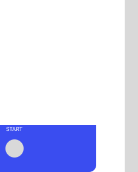

<h1>👋 - Hi visitor</h1>
<h3>I'm Charles Chrismann !</h3>

  

:technologist: I'm a french student in 3rd year in web development at <a href="https://www.iim.fr" target="_blank" rel="noreferrer" title="Institut de l'Internet et du Multimédia">IIM DigitalSchool</a> in Paris.

:heart: I am what you can call a javascript/typescript enthousiaste.

<h3 align="center">F*** Zodiac signs, let's play Pokemon together</h3>

  
   
  
  
  
   
  
   
  
  
   
  
  
  
  
  
   
  
  
   
  
  

:dart: I have the ambition to become a respectable full stack js developer, currently grinding on it.

Some facts:

<ul>
  <li>:two_hearts: I automatically likes anything ending with -lang & -land</li>
  <li>:book: I choose to learn a stack based on the fun of the name</li>
  <li>:cup_with_straw: Gin-Gonic just has the best name</li>
  <li>:sauropod: Deno is a better Node with a cut mascot</li>
  <li>:crab: & :otter: are better together (there is no gopher emoji and otters are cute)</li>
</ul>
<table align="center">
  <thead>
    <tr>
      <th colspan="3" width="512">Last Followers</th>
    </tr>
  </thead>
  <tbody>
    <tr>
      <td align="center">9494</td>
      <td align="center">
        
      </td>
      <td>
        <a href="https://github.com/hasnocool" target="_blank">hasnocool</a>
      </td>
    </tr>
    <tr>
      <td align="center">9495</td>
      <td align="center">
        
      </td>
      <td>
        <a href="https://github.com/spg-cs50" target="_blank">spg-cs50</a>
      </td>
    </tr>
    <tr>
      <td align="center">9496</td>
      <td align="center">
        
      </td>
      <td>
        <a href="https://github.com/The-Kundan" target="_blank">The-Kundan</a>
      </td>
    </tr>
    <tr>
      <td align="center">9497</td>
      <td align="center" colspan="2">Maybe You ? (can take a few minutes to update)</td>
    </tr>
  </tbody>
</table>
<h1 align="left">Reach Me</h1>

  
  

<h1 align="center">Technical skills</h1>
<h3 align="left">Currently learning:
  
</h3>
<h3>Front-end technologies</h3>

  
  
  
  
  
  
  

<h3>Back-end technologies</h3>

  
  
  
  
  
  
  

<h3>Other technologies where I have notions</h3>

  
  
  
  
  
  
  
  
  
  
  
  
  
  
  
  

<h3>Tools</h3>

  
  
  
  
  
  
  
  

<h1 align="center">Flex Zone</h1>
<h3 align="center">A classic Minesweeper</h3>

  <a href="https://o.charles-chrismann.fr/minesweeper/click?x=0&y=0">:black_large_square:</a>
  <a href="https://o.charles-chrismann.fr/minesweeper/click?x=1&y=0">:black_large_square:</a>
  <a href="https://o.charles-chrismann.fr/minesweeper/click?x=2&y=0">:black_large_square:</a>
  :boom:
  :boom:
  :boom:
  :one:
  :white_large_square:
  :white_large_square:
  :white_large_square:
  :one:
  :boom:
  :boom:
  <a href="https://o.charles-chrismann.fr/minesweeper/click?x=13&y=0">:black_large_square:</a>
  <a href="https://o.charles-chrismann.fr/minesweeper/click?x=14&y=0">:black_large_square:</a>
  <a href="https://o.charles-chrismann.fr/minesweeper/click?x=15&y=0">:black_large_square:</a>
  <a href="https://o.charles-chrismann.fr/minesweeper/click?x=16&y=0">:black_large_square:</a>
  <a href="https://o.charles-chrismann.fr/minesweeper/click?x=17&y=0">:black_large_square:</a>
   
  <a href="https://o.charles-chrismann.fr/minesweeper/click?x=0&y=1">:black_large_square:</a>
  :boom:
  <a href="https://o.charles-chrismann.fr/minesweeper/click?x=2&y=1">:black_large_square:</a>
  :three:
  :three:
  :two:
  :one:
  :white_large_square:
  :white_large_square:
  :white_large_square:
  :one:
  :three:
  :boom:
  <a href="https://o.charles-chrismann.fr/minesweeper/click?x=13&y=1">:black_large_square:</a>
  <a href="https://o.charles-chrismann.fr/minesweeper/click?x=14&y=1">:black_large_square:</a>
  <a href="https://o.charles-chrismann.fr/minesweeper/click?x=15&y=1">:black_large_square:</a>
  <a href="https://o.charles-chrismann.fr/minesweeper/click?x=16&y=1">:black_large_square:</a>
  <a href="https://o.charles-chrismann.fr/minesweeper/click?x=17&y=1">:black_large_square:</a>
   
  :boom:
  <a href="https://o.charles-chrismann.fr/minesweeper/click?x=1&y=2">:black_large_square:</a>
  :boom:
  :one:
  :white_large_square:
  :white_large_square:
  :white_large_square:
  :white_large_square:
  :white_large_square:
  :white_large_square:
  :white_large_square:
  :one:
  :one:
  :two:
  :boom:
  :boom:
  :boom:
  :boom:
   
  <a href="https://o.charles-chrismann.fr/minesweeper/click?x=0&y=3">:black_large_square:</a>
  <a href="https://o.charles-chrismann.fr/minesweeper/click?x=1&y=3">:black_large_square:</a>
  :one:
  :one:
  :white_large_square:
  :white_large_square:
  :white_large_square:
  :white_large_square:
  :white_large_square:
  :white_large_square:
  :white_large_square:
  :white_large_square:
  :white_large_square:
  :two:
  <a href="https://o.charles-chrismann.fr/minesweeper/click?x=14&y=3">:black_large_square:</a>
  :boom:
  <a href="https://o.charles-chrismann.fr/minesweeper/click?x=16&y=3">:black_large_square:</a>
  :boom:
   
  <a href="https://o.charles-chrismann.fr/minesweeper/click?x=0&y=4">:black_large_square:</a>
  <a href="https://o.charles-chrismann.fr/minesweeper/click?x=1&y=4">:black_large_square:</a>
  :one:
  :white_large_square:
  :white_large_square:
  :white_large_square:
  :white_large_square:
  :white_large_square:
  :one:
  :one:
  :one:
  :white_large_square:
  :white_large_square:
  :one:
  :boom:
  <a href="https://o.charles-chrismann.fr/minesweeper/click?x=15&y=4">:black_large_square:</a>
  :boom:
  <a href="https://o.charles-chrismann.fr/minesweeper/click?x=17&y=4">:black_large_square:</a>
   
  <a href="https://o.charles-chrismann.fr/minesweeper/click?x=0&y=5">:black_large_square:</a>
  :boom:
  :two:
  :white_large_square:
  :white_large_square:
  :white_large_square:
  :white_large_square:
  :white_large_square:
  :one:
  :boom:
  :two:
  :one:
  :one:
  :one:
  :two:
  :boom:
  :boom:
  <a href="https://o.charles-chrismann.fr/minesweeper/click?x=17&y=5">:black_large_square:</a>
   
  <a href="https://o.charles-chrismann.fr/minesweeper/click?x=0&y=6">:black_large_square:</a>
  :boom:
  :two:
  :white_large_square:
  :white_large_square:
  :white_large_square:
  :white_large_square:
  :white_large_square:
  :one:
  :one:
  <a href="https://o.charles-chrismann.fr/minesweeper/click?x=10&y=6">:black_large_square:</a>
  :boom:
  :one:
  :white_large_square:
  :one:
  :two:
  :two:
  :one:
   
  :one:
  :one:
  :one:
  :white_large_square:
  :white_large_square:
  :white_large_square:
  :white_large_square:
  :one:
  :one:
  :one:
  :one:
  :one:
  :one:
  :white_large_square:
  :white_large_square:
  :white_large_square:
  :white_large_square:
  :white_large_square:
   
  :white_large_square:
  :white_large_square:
  :white_large_square:
  :white_large_square:
  :white_large_square:
  :white_large_square:
  :white_large_square:
  :one:
  :boom:
  :one:
  :white_large_square:
  :white_large_square:
  :white_large_square:
  :white_large_square:
  :white_large_square:
  :white_large_square:
  :white_large_square:
  :white_large_square:
   
  :white_large_square:
  :white_large_square:
  :white_large_square:
  :white_large_square:
  :white_large_square:
  :white_large_square:
  :white_large_square:
  :one:
  :one:
  :one:
  :white_large_square:
  :white_large_square:
  :white_large_square:
  :white_large_square:
  :white_large_square:
  :white_large_square:
  :white_large_square:
  :white_large_square:
   
  :white_large_square:
  :white_large_square:
  :white_large_square:
  :white_large_square:
  :white_large_square:
  :white_large_square:
  :white_large_square:
  :white_large_square:
  :white_large_square:
  :white_large_square:
  :white_large_square:
  :white_large_square:
  :white_large_square:
  :white_large_square:
  :white_large_square:
  :white_large_square:
  :white_large_square:
  :white_large_square:
   
  :white_large_square:
  :white_large_square:
  :white_large_square:
  :white_large_square:
  :white_large_square:
  :white_large_square:
  :white_large_square:
  :white_large_square:
  :white_large_square:
  :white_large_square:
  :white_large_square:
  :white_large_square:
  :white_large_square:
  :white_large_square:
  :white_large_square:
  :white_large_square:
  :white_large_square:
  :white_large_square:
   
  :white_large_square:
  :white_large_square:
  :white_large_square:
  :white_large_square:
  :white_large_square:
  :white_large_square:
  :white_large_square:
  :white_large_square:
  :white_large_square:
  :white_large_square:
  :white_large_square:
  :white_large_square:
  :white_large_square:
  :white_large_square:
  :white_large_square:
  :white_large_square:
  :white_large_square:
  :white_large_square:
   
  :white_large_square:
  :white_large_square:
  :white_large_square:
  :white_large_square:
  :white_large_square:
  :white_large_square:
  :white_large_square:
  :white_large_square:
  :white_large_square:
  :white_large_square:
  :white_large_square:
  :white_large_square:
  :white_large_square:
  :white_large_square:
  :white_large_square:
  :white_large_square:
  :white_large_square:
  :white_large_square:

You lost don't hesitate to try again

  

<h3 align="center">
  <a href="https://o.charles-chrismann.fr/minesweeper/new">Reset Game</a>
</h3>

<h3 align="center">A classic Chess</h3>

  

It's Black's turn

<table align="center">
  <tbody>
    <tr>
      <td align="center">:eight:</td>
      <td align="center">♜      </td>
      <td align="center">
        

          
♞

          <a href="https://o.charles-chrismann.fr/chess/move?x1=1&y1=0&x2=0&y2=2">a6</a>
          <a href="https://o.charles-chrismann.fr/chess/move?x1=1&y1=0&x2=3&y2=1">d7</a>
        

      </td>
      <td align="center">‎       </td>
      <td align="center">
        

          
♛

          <a href="https://o.charles-chrismann.fr/chess/move?x1=3&y1=0&x2=2&y2=0">c8</a>
          <a href="https://o.charles-chrismann.fr/chess/move?x1=3&y1=0&x2=3&y2=1">d7</a>
          <a href="https://o.charles-chrismann.fr/chess/move?x1=3&y1=0&x2=3&y2=2">d6</a>
          <a href="https://o.charles-chrismann.fr/chess/move?x1=3&y1=0&x2=3&y2=3">d5</a>
           <a href="https://o.charles-chrismann.fr/chess/move?x1=3&y1=0&x2=3&y2=4">d4</a>
          <a href="https://o.charles-chrismann.fr/chess/move?x1=3&y1=0&x2=3&y2=5">d3</a>
          <a href="https://o.charles-chrismann.fr/chess/move?x1=3&y1=0&x2=3&y2=6">d2</a>
          <a href="https://o.charles-chrismann.fr/chess/move?x1=3&y1=0&x2=3&y2=7">d1</a>
           <a href="https://o.charles-chrismann.fr/chess/move?x1=3&y1=0&x2=4&y2=1">e7</a>
          <a href="https://o.charles-chrismann.fr/chess/move?x1=3&y1=0&x2=5&y2=2">f6</a>
        

      </td>
      <td align="center">
        

          
♚

          <a href="https://o.charles-chrismann.fr/chess/move?x1=4&y1=0&x2=3&y2=1">d7</a>
          <a href="https://o.charles-chrismann.fr/chess/move?x1=4&y1=0&x2=4&y2=1">e7</a>
        

      </td>
      <td align="center">
        

          
♝

          <a href="https://o.charles-chrismann.fr/chess/move?x1=5&y1=0&x2=6&y2=1">g7</a>
          <a href="https://o.charles-chrismann.fr/chess/move?x1=5&y1=0&x2=7&y2=2">h6</a>
          <a href="https://o.charles-chrismann.fr/chess/move?x1=5&y1=0&x2=4&y2=1">e7</a>
           <a href="https://o.charles-chrismann.fr/chess/move?x1=5&y1=0&x2=3&y2=2">d6</a>
          <a href="https://o.charles-chrismann.fr/chess/move?x1=5&y1=0&x2=2&y2=3">c5</a>
          <a href="https://o.charles-chrismann.fr/chess/move?x1=5&y1=0&x2=1&y2=4">b4</a>
           <a href="https://o.charles-chrismann.fr/chess/move?x1=5&y1=0&x2=0&y2=5">a3</a>
        

      </td>
      <td align="center">
        

          
♞

          <a href="https://o.charles-chrismann.fr/chess/move?x1=6&y1=0&x2=5&y2=2">f6</a>
          <a href="https://o.charles-chrismann.fr/chess/move?x1=6&y1=0&x2=7&y2=2">h6</a>
           <a href="https://o.charles-chrismann.fr/chess/move?x1=6&y1=0&x2=4&y2=1">e7</a>
        

      </td>
      <td align="center">‎       </td>
    </tr>
    <tr>
      <td align="center">:seven:</td>
      <td align="center">
        

          
♟

          <a href="https://o.charles-chrismann.fr/chess/move?x1=0&y1=1&x2=0&y2=2">a6</a>
        

      </td>
      <td align="center">
        

          
♟

          <a href="https://o.charles-chrismann.fr/chess/move?x1=1&y1=1&x2=1&y2=3">b5</a>
          <a href="https://o.charles-chrismann.fr/chess/move?x1=1&y1=1&x2=1&y2=2">b6</a>
        

      </td>
      <td align="center">
        

          
♜

          <a href="https://o.charles-chrismann.fr/chess/move?x1=2&y1=1&x2=3&y2=1">d7</a>
          <a href="https://o.charles-chrismann.fr/chess/move?x1=2&y1=1&x2=4&y2=1">e7</a>
           <a href="https://o.charles-chrismann.fr/chess/move?x1=2&y1=1&x2=2&y2=0">c8</a>
        

      </td>
      <td align="center">‎       </td>
      <td align="center">‎       </td>
      <td align="center">
        

          
♟

          <a href="https://o.charles-chrismann.fr/chess/move?x1=5&y1=1&x2=5&y2=3">f5</a>
          <a href="https://o.charles-chrismann.fr/chess/move?x1=5&y1=1&x2=5&y2=2">f6</a>
        

      </td>
      <td align="center">‎       </td>
      <td align="center">
        

          
♟

          <a href="https://o.charles-chrismann.fr/chess/move?x1=7&y1=1&x2=7&y2=3">h5</a>
          <a href="https://o.charles-chrismann.fr/chess/move?x1=7&y1=1&x2=7&y2=2">h6</a>
        

      </td>
    </tr>
    <tr>
      <td align="center">:six:</td>
      <td align="center">‎       </td>
      <td align="center">‎       </td>
      <td align="center">
        

          
♟

          <a href="https://o.charles-chrismann.fr/chess/move?x1=2&y1=2&x2=2&y2=3">c5</a>
        

      </td>
      <td align="center">‎       </td>
      <td align="center">‎       </td>
      <td align="center">‎       </td>
      <td align="center">‎       </td>
      <td align="center">‎       </td>
    </tr>
    <tr>
      <td align="center">:five:</td>
      <td align="center">♙      </td>
      <td align="center">‎       </td>
      <td align="center">‎       </td>
      <td align="center">‎       </td>
      <td align="center">‎       </td>
      <td align="center">‎       </td>
      <td align="center">
        

          
♟

          <a href="https://o.charles-chrismann.fr/chess/move?x1=6&y1=3&x2=6&y2=4">g4</a>
        

      </td>
      <td align="center">‎       </td>
    </tr>
    <tr>
      <td align="center">:four:</td>
      <td align="center">‎       </td>
      <td align="center">‎       </td>
      <td align="center">‎       </td>
      <td align="center">‎       </td>
      <td align="center">‎       </td>
      <td align="center">‎       </td>
      <td align="center">‎       </td>
      <td align="center">‎       </td>
    </tr>
    <tr>
      <td align="center">:three:</td>
      <td align="center">‎       </td>
      <td align="center">‎       </td>
      <td align="center">‎       </td>
      <td align="center">‎       </td>
      <td align="center">♙      </td>
      <td align="center">‎       </td>
      <td align="center">‎       </td>
      <td align="center">‎       </td>
    </tr>
    <tr>
      <td align="center">:two:</td>
      <td align="center">‎       </td>
      <td align="center">♙      </td>
      <td align="center">♙      </td>
      <td align="center">‎       </td>
      <td align="center">‎       </td>
      <td align="center">♙      </td>
      <td align="center">
        

          
♟

          <a href="https://o.charles-chrismann.fr/chess/move?x1=6&y1=6&x2=7&y2=7">h1</a>
          <a href="https://o.charles-chrismann.fr/chess/move?x1=6&y1=6&x2=5&y2=7">f1</a>
        

      </td>
      <td align="center">‎       </td>
    </tr>
    <tr>
      <td align="center">:one:</td>
      <td align="center">♖      </td>
      <td align="center">♘      </td>
      <td align="center">‎       </td>
      <td align="center">♗      </td>
      <td align="center">♔      </td>
      <td align="center">♙      </td>
      <td align="center">♘      </td>
      <td align="center">♖      </td>
    </tr>
  <tr>
    <td align="center"></td>
    <td align="center">🇦</td>
    <td align="center">🇧</td>
    <td align="center">🇨</td>
    <td align="center">🇩</td>
    <td align="center">🇪</td>
    <td align="center">🇫</td>
    <td align="center">🇬</td>
    <td align="center">🇭</td>
    </tr>
  </tbody>
</table><h3 align="center">
<a href="https://o.charles-chrismann.fr/chess/new">Reset Game</a>
</h3>

<h3 align="center">A classic Wordle</h3>
<table align="center">
  <thead>
    <tr>
      <th colspan="5">Wordle</th><th>Player</th>
    </tr>
  </thead>
  <tbody>
    <tr>
      <td>‎ </td>
      <td>‎ </td>
      <td>‎ </td>
      <td>‎ </td>
      <td>‎ </td>
      <td>
        <a href="https://github.com/Charles-Chrismann/Charles-Chrismann/issues/new?body=Please+only+add+your+word+to+the+title.+Just+click+%22Submit+new+issue%22.+You+don%27t+need+to+do+anything+else+%3AD&title=Wordle%3A+">Submit a word</a>
      </td>
    </tr>
  </tbody>
</table>
<table align="center">
  <thead>
    <tr>
      <th colspan="4">Scoreboard</th>
    </tr>
    <tr>
      <th>Rank</th>
      <th colspan="2">Player</th>
      <th>Wins</th>
    </tr>
  </thead>
  <tbody>
    <tr>
      <td align="center">1</td>
      <td align="center">
        
      </td>
      <td>
        <a href="https://github.com/Foword5">@Foword5</a>
      </td>
      <td align="center">15</td>
    </tr>
    <tr>
      <td align="center">2</td>
      <td align="center">
        
      </td>
      <td>
        <a href="https://github.com/Charles-Chrismann">@Charles-Chrismann</a>
      </td>
      <td align="center">10</td>
    </tr>
    <tr>
      <td align="center">3</td>
      <td align="center">
        
      </td>
      <td>
        <a href="https://github.com/GabrielTrifoni">@GabrielTrifoni</a>
      </td>
      <td align="center">2</td>
    </tr>
    <tr>
      <td align="center">4</td>
      <td align="center">
        
      </td>
      <td>
        <a href="https://github.com/IcaroD">@IcaroD</a>
      </td>
      <td align="center">1</td>
    </tr>
    <tr>
      <td align="center">5</td>
      <td align="center">
        
      </td>
      <td>
        <a href="https://github.com/TohidEq">@TohidEq</a>
      </td>
      <td align="center">1</td>
    </tr>
    <tr>
      <td align="center">6</td>
      <td align="center">
        
      </td>
      <td>
        <a href="https://github.com/huhuhu0420">@huhuhu0420</a>
      </td>
      <td align="center">1</td>
    </tr>
  </tbody>
</table>

<h1 align="center">Work in progress</h1>

Other features are in progress, feel free to follow me to discover them.

To understand how it works, take a look <a href="https://github.com/Charles-Chrismann/dynamic-readme" target="_blank" rel="noreferrer" title="github dynalic readme">here</a>

  

  <a href="https://github.com/Charles-Chrismann">See ya <3</a>

Generated in 0.192s on Fri Sep 13 at 4:41

