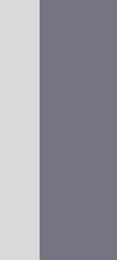
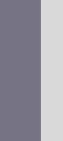

<h1>:wave: - Hi visitor</h1>
<h3>I'm Charles Chrismann !</h3>

:technologist: I'm a french student in 3rd year in web development at <a href="https://www.iim.fr" target="_blank" rel="noreferrer" title="Institut de l'Internet et du Multimédia">IIM DigitalSchool</a> in Paris.

:heart: I am what you can call a javascript/typescript enthousiaste.

:dart: I have the ambition to become a respectable full stack js developer, currently grinding on it.

Some facts:

<ul>
  <li>:two_hearts: I automatically likes anything ending with -lang & -land</li>
  <li>:book: I choose to learn a stack based on the fun of the name</li>
  <li>:cup_with_straw: Gin-Gonic just has the best name</li>
  <li>:sauropod: Deno is a better Node with a cut mascot</li>
  <li>:crab: & :otter: are better together (there is no gopher emoji and otters are cute)</li>
</ul>

My discord: @kymono

<table align="center">
  <thead>
    <tr>
      <th colspan="3" width="512">Last Followers</th>
    </tr>
  </thead>
  <tbody>
    <tr>
      <td align="center">20</td>
      <td align="center">
        
      </td>
      <td>
        <a href="https://github.com/Foword5" target="_blank">Foword5</a>
      </td>
    </tr>
    <tr>
      <td align="center">21</td>
      <td align="center">
        
      </td>
      <td>
        <a href="https://github.com/Clansou" target="_blank">Clansou</a>
      </td>
    </tr>
    <tr>
      <td align="center">22</td>
      <td align="center">
        
      </td>
      <td>
        <a href="https://github.com/ChampiEZ" target="_blank">ChampiEZ</a>
      </td>
    </tr>
    <tr>
      <td align="center">23</td>
      <td align="center" colspan="2">Maybe You ? (can take a few minutes to update)</td>
    </tr>
  </tbody>
</table>
<h1 align="left">Reach Me</h1>

  

<h1 align="center">Technical skills</h1>
<h3 align="left">Currently learning:
  
</h3>
<h3>Front-end technologies</h3>

  
  
  
  
  
  
  

<h3>Back-end technologies</h3>

  
  
  
  
  
  
  

<h3>Other technologies where I have notions</h3>

  
  
  
  
  
  
  
  
  
  
  
  
  
  
  
  

<h3>Tools</h3>

  
  
  
  
  
  
  
  

<h1 align="center">Flex Zone</h1>
<h3 align="center">GitHub Plays Pokemon ?</h3>

  
   
  
  
  
   
  
   
  
  
  
   
  
  
  
  
  
   
  
  
  
   
  
  
  
  
   
  

<table align="center">
  <thead>
    <tr>
      <th colspan="4">Game Contributions</th>
    </tr>
    <tr>
      <th>Rank</th>
      <th colspan="2">Player</th>
      <th>Inputs</th>
    </tr>
  </thead>
  <tbody>
    <tr>
      <td align="center">1</td>
      <td align="center"><a href="https://github.com/Charles-Chrismann"></img></td>
      <td align="center"><a href="https://github.com/Charles-Chrismann">@Charles-Chrismann</a></td>
      <td align="center">876</td>
    </tr>
    <tr>
      <td align="center">2</td>
      <td align="center"><a href="https://github.com/Foword5"></img></td>
      <td align="center"><a href="https://github.com/Foword5">@Foword5</a></td>
      <td align="center">113</td>
    </tr>
    <tr>
      <td colspan="4" align="center"><a href="http://aws-v.charles-chrismann.fr/client.html">Play with your Github account here !</a></td>
    </tr>
  </tbody>
</table>

<h3 align="center">A classic Minesweeper</h3>

  <a href="http://aws-v.charles-chrismann.fr/minesweeper/click?x=0&y=0">:black_large_square:</a>
  <a href="http://aws-v.charles-chrismann.fr/minesweeper/click?x=1&y=0">:black_large_square:</a>
  <a href="http://aws-v.charles-chrismann.fr/minesweeper/click?x=2&y=0">:black_large_square:</a>
  <a href="http://aws-v.charles-chrismann.fr/minesweeper/click?x=3&y=0">:black_large_square:</a>
  <a href="http://aws-v.charles-chrismann.fr/minesweeper/click?x=4&y=0">:black_large_square:</a>
  <a href="http://aws-v.charles-chrismann.fr/minesweeper/click?x=5&y=0">:black_large_square:</a>
  <a href="http://aws-v.charles-chrismann.fr/minesweeper/click?x=6&y=0">:black_large_square:</a>
  <a href="http://aws-v.charles-chrismann.fr/minesweeper/click?x=7&y=0">:black_large_square:</a>
  <a href="http://aws-v.charles-chrismann.fr/minesweeper/click?x=8&y=0">:black_large_square:</a>
  <a href="http://aws-v.charles-chrismann.fr/minesweeper/click?x=9&y=0">:black_large_square:</a>
  <a href="http://aws-v.charles-chrismann.fr/minesweeper/click?x=10&y=0">:black_large_square:</a>
  <a href="http://aws-v.charles-chrismann.fr/minesweeper/click?x=11&y=0">:black_large_square:</a>
  <a href="http://aws-v.charles-chrismann.fr/minesweeper/click?x=12&y=0">:black_large_square:</a>
  :one:
  :white_large_square:
  :white_large_square:
  :white_large_square:
  :white_large_square:
   
  <a href="http://aws-v.charles-chrismann.fr/minesweeper/click?x=0&y=1">:black_large_square:</a>
  <a href="http://aws-v.charles-chrismann.fr/minesweeper/click?x=1&y=1">:black_large_square:</a>
  <a href="http://aws-v.charles-chrismann.fr/minesweeper/click?x=2&y=1">:black_large_square:</a>
  <a href="http://aws-v.charles-chrismann.fr/minesweeper/click?x=3&y=1">:black_large_square:</a>
  <a href="http://aws-v.charles-chrismann.fr/minesweeper/click?x=4&y=1">:black_large_square:</a>
  <a href="http://aws-v.charles-chrismann.fr/minesweeper/click?x=5&y=1">:black_large_square:</a>
  <a href="http://aws-v.charles-chrismann.fr/minesweeper/click?x=6&y=1">:black_large_square:</a>
  :two:
  :two:
  :two:
  <a href="http://aws-v.charles-chrismann.fr/minesweeper/click?x=10&y=1">:black_large_square:</a>
  <a href="http://aws-v.charles-chrismann.fr/minesweeper/click?x=11&y=1">:black_large_square:</a>
  <a href="http://aws-v.charles-chrismann.fr/minesweeper/click?x=12&y=1">:black_large_square:</a>
  :one:
  :white_large_square:
  :white_large_square:
  :white_large_square:
  :white_large_square:
   
  :one:
  :one:
  :one:
  <a href="http://aws-v.charles-chrismann.fr/minesweeper/click?x=3&y=2">:black_large_square:</a>
  <a href="http://aws-v.charles-chrismann.fr/minesweeper/click?x=4&y=2">:black_large_square:</a>
  <a href="http://aws-v.charles-chrismann.fr/minesweeper/click?x=5&y=2">:black_large_square:</a>
  <a href="http://aws-v.charles-chrismann.fr/minesweeper/click?x=6&y=2">:black_large_square:</a>
  :one:
  :white_large_square:
  :one:
  :one:
  :two:
  :one:
  :one:
  :white_large_square:
  :one:
  :one:
  :one:
   
  :white_large_square:
  :white_large_square:
  :one:
  :two:
  <a href="http://aws-v.charles-chrismann.fr/minesweeper/click?x=4&y=3">:black_large_square:</a>
  :two:
  :one:
  :one:
  :white_large_square:
  :white_large_square:
  :white_large_square:
  :white_large_square:
  :white_large_square:
  :white_large_square:
  :white_large_square:
  :one:
  <a href="http://aws-v.charles-chrismann.fr/minesweeper/click?x=16&y=3">:black_large_square:</a>
  <a href="http://aws-v.charles-chrismann.fr/minesweeper/click?x=17&y=3">:black_large_square:</a>
   
  :white_large_square:
  :white_large_square:
  :white_large_square:
  :one:
  <a href="http://aws-v.charles-chrismann.fr/minesweeper/click?x=4&y=4">:black_large_square:</a>
  :one:
  :white_large_square:
  :white_large_square:
  :white_large_square:
  :white_large_square:
  :white_large_square:
  :white_large_square:
  :white_large_square:
  :white_large_square:
  :white_large_square:
  :one:
  :one:
  :one:
   
  :white_large_square:
  :white_large_square:
  :white_large_square:
  :one:
  :one:
  :one:
  :white_large_square:
  :white_large_square:
  :white_large_square:
  :white_large_square:
  :white_large_square:
  :white_large_square:
  :white_large_square:
  :white_large_square:
  :white_large_square:
  :white_large_square:
  :white_large_square:
  :white_large_square:
   
  :white_large_square:
  :white_large_square:
  :white_large_square:
  :white_large_square:
  :white_large_square:
  :white_large_square:
  :white_large_square:
  :one:
  :one:
  :one:
  :white_large_square:
  :white_large_square:
  :white_large_square:
  :white_large_square:
  :white_large_square:
  :white_large_square:
  :white_large_square:
  :white_large_square:
   
  :white_large_square:
  :one:
  :one:
  :one:
  :one:
  :one:
  :one:
  :one:
  <a href="http://aws-v.charles-chrismann.fr/minesweeper/click?x=8&y=7">:black_large_square:</a>
  :three:
  :two:
  :two:
  :one:
  :one:
  :white_large_square:
  :white_large_square:
  :white_large_square:
  :white_large_square:
   
  :white_large_square:
  :one:
  <a href="http://aws-v.charles-chrismann.fr/minesweeper/click?x=2&y=8">:black_large_square:</a>
  <a href="http://aws-v.charles-chrismann.fr/minesweeper/click?x=3&y=8">:black_large_square:</a>
  <a href="http://aws-v.charles-chrismann.fr/minesweeper/click?x=4&y=8">:black_large_square:</a>
  <a href="http://aws-v.charles-chrismann.fr/minesweeper/click?x=5&y=8">:black_large_square:</a>
  :one:
  :one:
  :two:
  <a href="http://aws-v.charles-chrismann.fr/minesweeper/click?x=9&y=8">:black_large_square:</a>
  <a href="http://aws-v.charles-chrismann.fr/minesweeper/click?x=10&y=8">:black_large_square:</a>
  <a href="http://aws-v.charles-chrismann.fr/minesweeper/click?x=11&y=8">:black_large_square:</a>
  <a href="http://aws-v.charles-chrismann.fr/minesweeper/click?x=12&y=8">:black_large_square:</a>
  :two:
  :one:
  :one:
  :one:
  :white_large_square:
   
  :white_large_square:
  :one:
  :one:
  :one:
  <a href="http://aws-v.charles-chrismann.fr/minesweeper/click?x=4&y=9">:black_large_square:</a>
  :one:
  :one:
  :white_large_square:
  :one:
  :two:
  :two:
  :three:
  <a href="http://aws-v.charles-chrismann.fr/minesweeper/click?x=12&y=9">:black_large_square:</a>
  <a href="http://aws-v.charles-chrismann.fr/minesweeper/click?x=13&y=9">:black_large_square:</a>
  <a href="http://aws-v.charles-chrismann.fr/minesweeper/click?x=14&y=9">:black_large_square:</a>
  <a href="http://aws-v.charles-chrismann.fr/minesweeper/click?x=15&y=9">:black_large_square:</a>
  :two:
  :white_large_square:
   
  :white_large_square:
  :white_large_square:
  :white_large_square:
  :one:
  <a href="http://aws-v.charles-chrismann.fr/minesweeper/click?x=4&y=10">:black_large_square:</a>
  :one:
  :white_large_square:
  :white_large_square:
  :white_large_square:
  :white_large_square:
  :white_large_square:
  :one:
  :one:
  :two:
  <a href="http://aws-v.charles-chrismann.fr/minesweeper/click?x=14&y=10">:black_large_square:</a>
  <a href="http://aws-v.charles-chrismann.fr/minesweeper/click?x=15&y=10">:black_large_square:</a>
  :two:
  :white_large_square:
   
  :white_large_square:
  :white_large_square:
  :white_large_square:
  :one:
  <a href="http://aws-v.charles-chrismann.fr/minesweeper/click?x=4&y=11">:black_large_square:</a>
  :one:
  :white_large_square:
  :white_large_square:
  :white_large_square:
  :white_large_square:
  :white_large_square:
  :white_large_square:
  :white_large_square:
  :one:
  :two:
  :two:
  :one:
  :white_large_square:
   
  :one:
  :one:
  :one:
  :two:
  <a href="http://aws-v.charles-chrismann.fr/minesweeper/click?x=4&y=12">:black_large_square:</a>
  :one:
  :one:
  :one:
  :one:
  :white_large_square:
  :white_large_square:
  :white_large_square:
  :one:
  :one:
  :one:
  :white_large_square:
  :white_large_square:
  :white_large_square:
   
  <a href="http://aws-v.charles-chrismann.fr/minesweeper/click?x=0&y=13">:black_large_square:</a>
  <a href="http://aws-v.charles-chrismann.fr/minesweeper/click?x=1&y=13">:black_large_square:</a>
  <a href="http://aws-v.charles-chrismann.fr/minesweeper/click?x=2&y=13">:black_large_square:</a>
  <a href="http://aws-v.charles-chrismann.fr/minesweeper/click?x=3&y=13">:black_large_square:</a>
  <a href="http://aws-v.charles-chrismann.fr/minesweeper/click?x=4&y=13">:black_large_square:</a>
  <a href="http://aws-v.charles-chrismann.fr/minesweeper/click?x=5&y=13">:black_large_square:</a>
  <a href="http://aws-v.charles-chrismann.fr/minesweeper/click?x=6&y=13">:black_large_square:</a>
  <a href="http://aws-v.charles-chrismann.fr/minesweeper/click?x=7&y=13">:black_large_square:</a>
  :one:
  :white_large_square:
  :white_large_square:
  :white_large_square:
  :one:
  <a href="http://aws-v.charles-chrismann.fr/minesweeper/click?x=13&y=13">:black_large_square:</a>
  :one:
  :white_large_square:
  :white_large_square:
  :white_large_square:

Keep clearing, there are still many mines left.

  

<h3 align="center">
  <a href="http://aws-v.charles-chrismann.fr/minesweeper/new">Reset Game</a>
</h3>

<h3 align="center">A classic Chess</h3>

  

It's White's turn

<table align="center">
  <tbody>
    <tr>
      <td align="center">:eight:</td>
      <td align="center">♜      </td>
      <td align="center">♞      </td>
      <td align="center">‎       </td>
      <td align="center">‎       </td>
      <td align="center">‎       </td>
      <td align="center">♝      </td>
      <td align="center">♞      </td>
      <td align="center">♜      </td>
    </tr>
    <tr>
      <td align="center">:seven:</td>
      <td align="center">♟      </td>
      <td align="center">♟      </td>
      <td align="center">♟      </td>
      <td align="center">‎       </td>
      <td align="center">♟      </td>
      <td align="center">♟      </td>
      <td align="center">♟      </td>
      <td align="center">
        

          
♙

          <a href="http://aws-v.charles-chrismann.fr/chess/move?x1=7&y1=1&x2=6&y2=0">g8</a>
        

      </td>
    </tr>
    <tr>
      <td align="center">:six:</td>
      <td align="center">‎       </td>
      <td align="center">‎       </td>
      <td align="center">‎       </td>
      <td align="center">‎       </td>
      <td align="center">♚      </td>
      <td align="center">‎       </td>
      <td align="center">‎       </td>
      <td align="center">‎       </td>
    </tr>
    <tr>
      <td align="center">:five:</td>
      <td align="center">‎       </td>
      <td align="center">‎       </td>
      <td align="center">‎       </td>
      <td align="center">‎       </td>
      <td align="center">‎       </td>
      <td align="center">‎       </td>
      <td align="center">‎       </td>
      <td align="center">‎       </td>
    </tr>
    <tr>
      <td align="center">:four:</td>
      <td align="center">‎       </td>
      <td align="center">‎       </td>
      <td align="center">‎       </td>
      <td align="center">
        

          
♙

          <a href="http://aws-v.charles-chrismann.fr/chess/move?x1=3&y1=4&x2=3&y2=3">d5</a>
        

      </td>
      <td align="center">‎       </td>
      <td align="center">‎       </td>
      <td align="center">‎       </td>
      <td align="center">‎       </td>
    </tr>
    <tr>
      <td align="center">:three:</td>
      <td align="center">
        

          
♗

          <a href="http://aws-v.charles-chrismann.fr/chess/move?x1=0&y1=5&x2=1&y2=6">b2</a>
          <a href="http://aws-v.charles-chrismann.fr/chess/move?x1=0&y1=5&x2=1&y2=4">b4</a>
          <a href="http://aws-v.charles-chrismann.fr/chess/move?x1=0&y1=5&x2=2&y2=3">c5</a>
           <a href="http://aws-v.charles-chrismann.fr/chess/move?x1=0&y1=5&x2=3&y2=2">d6</a>
          <a href="http://aws-v.charles-chrismann.fr/chess/move?x1=0&y1=5&x2=4&y2=1">e7</a>
        

      </td>
      <td align="center">‎       </td>
      <td align="center">‎       </td>
      <td align="center">‎       </td>
      <td align="center">‎       </td>
      <td align="center">‎       </td>
      <td align="center">‎       </td>
      <td align="center">♛      </td>
    </tr>
    <tr>
      <td align="center">:two:</td>
      <td align="center">♙      </td>
      <td align="center">‎       </td>
      <td align="center">‎       </td>
      <td align="center">‎       </td>
      <td align="center">
        

          
♙

          <a href="http://aws-v.charles-chrismann.fr/chess/move?x1=4&y1=6&x2=4&y2=4">e4</a>
          <a href="http://aws-v.charles-chrismann.fr/chess/move?x1=4&y1=6&x2=4&y2=5">e3</a>
        

      </td>
      <td align="center">
        

          
♙

          <a href="http://aws-v.charles-chrismann.fr/chess/move?x1=5&y1=6&x2=5&y2=4">f4</a>
          <a href="http://aws-v.charles-chrismann.fr/chess/move?x1=5&y1=6&x2=5&y2=5">f3</a>
        

      </td>
      <td align="center">
        

          
♙

          <a href="http://aws-v.charles-chrismann.fr/chess/move?x1=6&y1=6&x2=6&y2=4">g4</a>
          <a href="http://aws-v.charles-chrismann.fr/chess/move?x1=6&y1=6&x2=6&y2=5">g3</a>
           <a href="http://aws-v.charles-chrismann.fr/chess/move?x1=6&y1=6&x2=7&y2=5">h3</a>
        

      </td>
      <td align="center">♙      </td>
    </tr>
    <tr>
      <td align="center">:one:</td>
      <td align="center">♖      </td>
      <td align="center">
        

          
♘

          <a href="http://aws-v.charles-chrismann.fr/chess/move?x1=1&y1=7&x2=2&y2=5">c3</a>
          <a href="http://aws-v.charles-chrismann.fr/chess/move?x1=1&y1=7&x2=3&y2=6">d2</a>
        

      </td>
      <td align="center">
        

          
♙

          <a href="http://aws-v.charles-chrismann.fr/chess/move?x1=2&y1=7&x2=2&y2=6">c2</a>
        

      </td>
      <td align="center">
        

          
♕

          <a href="http://aws-v.charles-chrismann.fr/chess/move?x1=3&y1=7&x2=3&y2=6">d2</a>
          <a href="http://aws-v.charles-chrismann.fr/chess/move?x1=3&y1=7&x2=3&y2=5">d3</a>
          <a href="http://aws-v.charles-chrismann.fr/chess/move?x1=3&y1=7&x2=2&y2=6">c2</a>
           <a href="http://aws-v.charles-chrismann.fr/chess/move?x1=3&y1=7&x2=1&y2=5">b3</a>
          <a href="http://aws-v.charles-chrismann.fr/chess/move?x1=3&y1=7&x2=0&y2=4">a4</a>
        

      </td>
      <td align="center">
        

          
♔

          <a href="http://aws-v.charles-chrismann.fr/chess/move?x1=4&y1=7&x2=3&y2=6">d2</a>
        

      </td>
      <td align="center">♗      </td>
      <td align="center">
        

          
♘

          <a href="http://aws-v.charles-chrismann.fr/chess/move?x1=6&y1=7&x2=5&y2=5">f3</a>
          <a href="http://aws-v.charles-chrismann.fr/chess/move?x1=6&y1=7&x2=7&y2=5">h3</a>
        

      </td>
      <td align="center">♖      </td>
    </tr>
  <tr>
    <td align="center"></td>
    <td align="center">🇦</td>
    <td align="center">🇧</td>
    <td align="center">🇨</td>
    <td align="center">🇩</td>
    <td align="center">🇪</td>
    <td align="center">🇫</td>
    <td align="center">🇬</td>
    <td align="center">🇭</td>
    </tr>
  </tbody>
</table><h3 align="center">
<a href="http://aws-v.charles-chrismann.fr/chess/new">Reset Game</a>
</h3>

<h3 align="center">A classic Wordle</h3>
<table align="center">
  <thead>
    <tr>
      <th colspan="5">Wordle</th><th>Player</th>
    </tr>
  </thead>
  <tbody>
    <tr>
      <td>‎ </td>
      <td>‎ </td>
      <td>‎ </td>
      <td>‎ </td>
      <td>‎ </td>
      <td>
        <a href="https://github.com/Charles-Chrismann/Charles-Chrismann/issues/new?body=Please+only+add+your+word+to+the+title.+Just+click+%22Submit+new+issue%22.+You+don%27t+need+to+do+anything+else+%3AD&title=Wordle%3A+">Submit a word</a>
      </td>
    </tr>
  </tbody>
</table>
<table align="center">
  <thead>
    <tr>
      <th colspan="4">Scoreboard</th>
    </tr>
    <tr>
      <th>Rank</th>
      <th colspan="2">Player</th>
      <th>Wins</th>
    </tr>
  </thead>
  <tbody>
    <tr>
      <td align="center">1</td>
      <td align="center">
        
      </td>
      <td>
        <a href="https://github.com/Charles-Chrismann">@Charles-Chrismann</a>
      </td>
      <td align="center">7</td>
    </tr>
    <tr>
      <td align="center">2</td>
      <td align="center">
        
      </td>
      <td>
        <a href="https://github.com/Foword5">@Foword5</a>
      </td>
      <td align="center">5</td>
    </tr>
  </tbody>
</table>

<h1 align="center">Work in progress</h1>

Other features are in progress, feel free to follow me to discover them.

To understand how it works, take a look <a href="https://github.com/Charles-Chrismann/dynamic-readme" target="_blank" rel="noreferrer" title="github dynalic readme">here</a>

  

  <a href="https://github.com/Charles-Chrismann">See ya <3</a>

Generated in 0.462s on Sat May 4 at 7:41

